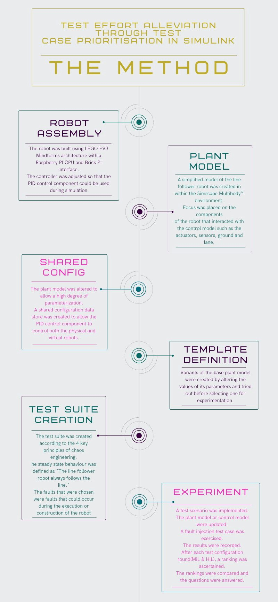
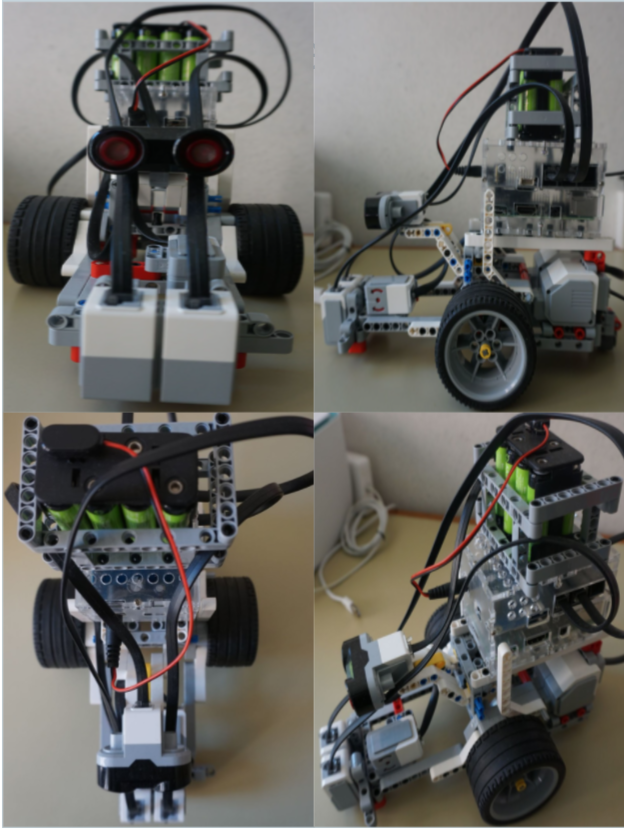
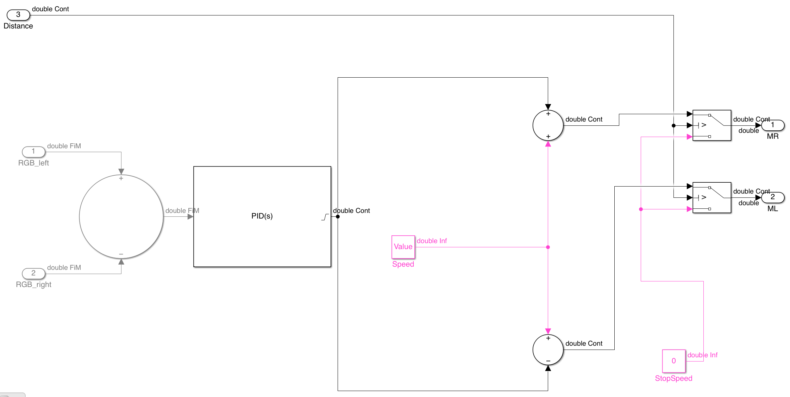
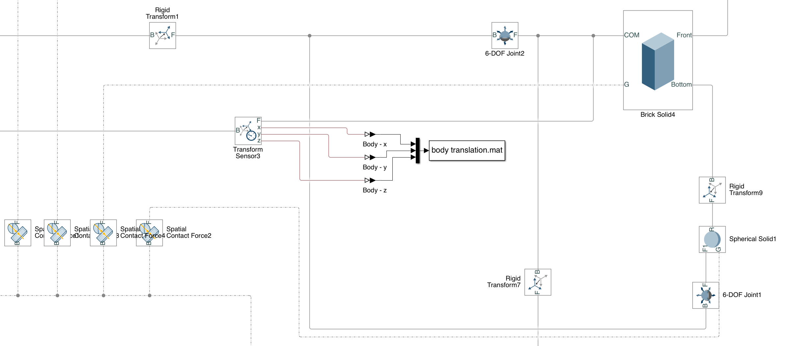

# Test Effort Alleviation Through Test Case Prioritization in Simulink

This webpage provides extended information about the method utilised and results observed when conducting the feasibility study about how test effort may be alleviated through test case prioritisation using a mechanical plant model of a cyber physical system.

## 1. Method
To answer the research questions, we identified the following high level requirements to develop research artifacts:

1. A physical cyber-physical system to test.
2. A plant model of that system created within the Simscape Multibody™ environment.
3. A set of test scenarios to prioritise.
4. A set of models of test scenarios, one for each physical test scenario.
5. A set faults to inject into the plant model and apply to the physical robot.
6. A set of metrics to rank the test scenarios.

Figure 1 shows a summary of the method used.
<figure>

<figcaption align="center">Figure 1: Method in a nutshell.</figcaption>

</figure>

## 1.1. Robot Assembly and Control Model Implementation

The robot was built using [LEGO MINDSTORMS EV3](https://education.LEGO.com/en-us/products/LEGO-mindstorms-education-ev3-core-set/5003400#
LEGO-mindstorms-education-ev3) infrastructure and it’s central processing unit was a [Raspberry PI](https://www.raspberrypi.org/products/raspberry-pi-3-model-b/) unit atop a [Brick PI](https://www.dexterindustries.com/brickpi-core/) block that served as an interface to the LEGO MINDSTORMS EV3 actuators and sensors.
The [MATLAB Support Package for Raspberry Pi](https://nl.mathworks.com/hardware-support/raspberry-pi-MATLAB.html) was used to create the control model(controller) that is run on the Raspberry PI hardware and controls the movement of the robot.
<figure>

<figcaption align="center">Figure 2: Robot.</figcaption>

</figure>
The control model of the robot was altered so that the LineFollowControl model component was it's own model that could be referenced by other models. This was done to allow it to be used to control the plant model of the robot during simulation.
<figure>

<figcaption align="center">Figure 3: The figure shows the control model altered by extracting the LineFollowControl sub-model and re-importing it as a Referenced model.</figcaption>

</figure>
<figure>

<figcaption align="center">Figure 4: The LineFollowControl sub-model that contained the PID control logic.</figcaption>

</figure>

## 1.2. Plant Model Implementation
A simplified model of the line follower robot was created in within the Simscape Multibody™ environment. Most of the work effort was placed on the components of the robot that interacted with the control model such as the actuators, sensors, ground and lane. Less emphasis was placed on modelling components that did not considerably affect the simulation results such as the body component.

### 1.2.1. Ground and Lane Implementation
The ground was modelled as an [Infinite plane](https://in.mathworks.com/help/physmod/sm/ref/infiniteplane.html) block connected to the World Frame block. The lane was implemented as a pair of nonintersecting [splines](https://in.mathworks.com/help/physmod/sm/ref/spline.html). This way, the track could be defined using mathematical functions.
<figure>

<figcaption align="center">Figure 5: The figure shows the ground and track implemented as an infinite plane block and a pair of spline blocks
respectively.</figcaption>

</figure>

### 1.2.2. Sensor Subsystem Implementation
The sensor subsystem comprised 2 [brick solid](https://in.mathworks.com/help/physmod/sm/ref/bricksolid.html) blocks that were rigidly connected to the front of the body. A [Transform Sensor](https://in.mathworks.com/help/physmod/sm/ref/transformsensor.html) block was attached to each sensor
block. In this case, we were interested in measuring the x-,
y- and z-coordinates of the relative translation vectors of each sensor block resolved in the Cartesian coordinate system, returned as scalars.
The scalar values we obtained were then passed into 2 independent functions that helped track the position of the model robot within the model track.
<figure>

<figcaption align="center">Figure 6: The figures shows a close up of the sensor subsystem that models the sensors of the physical robot.</figcaption>

</figure>

### 1.2.3. Controller Implementation
The *LineFollowControl* block, Figure 4, of the control model of the actual robot was extracted into it’s own
Subsystem model file. This allowed us to include it as a referenced model in the plant model of the robot.
For input, we passed it the mock sensor readings generated by the *getReading* block of the Sensor
subsystem.

### 1.2.4. Motor Subsystem Implementation
The Motor Subsystem was modelled using a constant block that has a configurable ideal torque input of [0.2Nm](https://www.LEGO.com/cdn/cs/set/assets/bltbef4d6ce0f40363c/LMSUser_Guide_LEGO_MINDSTORMS_EV3_
11_Tablet_ENUS.pdf).
Within the plant model, since the wheels were represented by [Revolute joints](https://www.mathworks.com/help/physmod/sm/ref/revolutejoint.html), the actuation force
percentage output from the *LineFollowControl* was instead multiplied by the ideal torque value. This
value was then converted into a physical signal by the [Simulink-PS Converter block](https://www.mathworks.com/help/physmod/simscape/ref/simulinkpsconverter.html) and fed to the Revolute joint blocks.
<figure>

<figcaption align="center">Figure 7: The Motor Subsystem.</figcaption>

</figure>

### 1.2.5. Wheel Subsystem Implementation
Each wheel, Figure 8, was modelled using 3 pairs of [Spatial Contact Force](https://in.mathworks.com/help/physmod/sm/ref/spatialcontactforce.html) blocks and [Spherical
solid](https://in.mathworks.com/help/physmod/sm/ref/sphericalsolid.html) blocks, 2 of which were attached to an [Extruded solid](https://in.mathworks.com/help/physmod/sm/ref/extrudedsolid.html) block.

<figure>

<figcaption align="center">Figure 8: The Wheel Subsystem.</figcaption>

</figure>

The Spatial Contact Force blocks
model the frictional forces applied between the wheels and the ground, infinite plane. The Spherical
solid blocks modelled the physical properties of the wheels such as the mass. The Extruded Solid block
only offered the visual representation of the wheel.

### 1.2.6. Body Implementation
The rest of the body, Figure 9, was implemented as a single Brick solid block. There was a single
Spherical solid block attached at the back of the main solid to model the corresponding metal wheel at
the back of the actual robot. There were Spatial Contact Force blocks for both sensors, the Spherical
solid at the back, and the body. The body is modelled in this simple manner because adding more
detail to the body would not have added a significant amount of value to the simulation process. On
the other hand, adding more detail would have added a comparable simulation overhead since each new
component would have meant an additional equation to be solved during simulation.
<figure>

<figcaption align="center">Figure 8: The Body.</figcaption>

</figure>

## 1.3. Shared Configuration Creation
The plant model was designed so that it had a high degree of parameterization that would help create variants of the base model later on.
Since the LineFollowControl sub model needed to be shared by 2 independent models, it was necessary to create a shared configuration data store.

## 1.4. Template Definition
The parameterization of the plant model enabled the creation of variants of the base model with the same
default values. Several variants were tried out before settling on the one used for the experiments.

## 1.5. Test Suite Creation
The test suite was created according to the 4 key principles of chaos
engineering.

### 1.5.1. Principle 1: Hypothesis around Steady State Behaviour 
> The line follower robot always follows the line.

To prove that this hypothesis holds, two test cases were added that would demonstrate this steady state
behaviour.

### 1.5.2. Principle 2: Vary Real World Events
To vary real world events, the faults that were chosen were faults that could occur during the execution
or construction of the robot. The test scenarios as well were variants of tracks that could be built using
the tiles provided.

The table below shows a mapping of the faults that were introduced to their corresponding test cases.

| Fault                     | Fault Code | Test Case Name      |
|---------------------------|------------|---------------------|
| F1 = Wheel Size Fault     | F1 : 1     | Wheel Fault 1.0     |
|                           | F1 : 2     | Wheel Fault 0.8     |
|                           | F1 : 3     | Wheel Fault 0.6     |
| F2 = Gyro Sensor Fault    | F2 : 1     | Obstacle Fault 1000 |
|                           | F2 : 2     | Obstacle Fault 0    |
| F3 = Light Sensor Fault   | F3         | Right Sensor Fault  |
| F4 = Motor Fault          | F4         | Right Motor Fault   |
| F5 = PID Controller Fault | F5         | PID Fault P 0       |

These five faults were selected because they are representative of real-world faults that could occur during
the operation of a cyber-physical system and the blast radius of their implementation on the physical
robot was manageable, in other words, they would not cause significant damage to the robot.

The test suite comprised of 10 test scenarios portraying different types of track arrangements. The main
metric to rank them is the number of faults that were detected by each test scenario. The sub metrics to
be considered as tie breakers were the simplicity of the test scenario.

For the physical implementation for each test scenario, this came down to the number of tiles used.
However, for the virtual implementations, this came down to the number of different alterations that had
to be applied to the base model to create the test scenario. These sub metrics were chosen because they
were all representative of test effort expended during the testing process of the line follower robot of this
study. However, in a larger context they served as proxies for estimates of the real test effort required at
both levels.

The model alterations included:

* **MA1**: Changing the Track Function argument values such as the squared-ness or the radius of the
squircle track creation function.
* **MA2**: Matrix splicing - through eliminating some elements of the matrix generated by the track
creation function. This also entails repositioning the robot and altering the line checking functions.
* **MA3**: Matrix manipulation I - through editing the matrix generated by the track creation function
beyond splicing without rotation. This also entails repositioning the robot and altering the line
checking functions.
* **MA4**: Matrix manipulation II - through editing the matrix generated by the track creation function
beyond splicing with rotation. This also entails repositioning the robot and altering the line
checking functions.

### 1.5.3. Principle 3: Run Experiments in Production
This principle was achieved by running the test suite on a production ready robot. Running the test suite
on the actual robot also allowed us to answer both research questions.

### 1.5.4. Principle 4: Automate Experiments to run Continuously
Even though automation of the experiments was not part of the scope of this work. We provided a
description of how this might be achieved which is described in the results and analysis.

### 1.5.5. Test Scenarios

<figure>

<figcaption align="center">Figure 9: The Physical Test Scenarios alongside their Virtual Counterparts.</figcaption>

</figure>

<figure>

<figcaption align="center">Figure 10: The Physical Test Scenarios alongside their Virtual Counterparts.</figcaption>

</figure>

### 1.5.6. Faults

<figure>

<figcaption align="center">Figure 11: The HiL Wheel Size Fault.</figcaption>

</figure>
<figure>

<figcaption align="center">Figure 12: The HiL Obstacle Fault.</figcaption>

</figure>
<figure>

<figcaption align="center">Figure 13: The HiL Sensor Fault.</figcaption>

</figure>
<figure>

<figcaption align="center">Figure 14: The HiL Motor Fault.</figcaption>

</figure>

At the MiL test configuration level, the faults were implemented as changes to the model or to the model configuration.

## 2. Experimentation
To conduct the experiments and come up with answers to the research questions the following steps
were taken.

### 2.1. RQ1. Is it feasible to prioritize Hardware-in-the-Loop (HiL) test scenarios at the Model-in-the-Loop (MiL) stage through fault injection thus alleviating some of the effort required for testing?
For each test scenario, the following steps were taken:

1. Within the plant model, one of the faults was implemented. The fault implementation went in
order from Fault 1 to Fault 5.
2. A test scenario was selected. In our case, we went through them in the order presented, from Test
Scenario 1 to Test Scenario 10.
3. The code representing the test scenario in the plant model was uncommented, so that the track
within the plant model would change accordingly.
4. The plant model position tracking functions were adjusted to cater for the size of the
matrices since this was not automatable due to the MATLAB code generation process restrictions.
5. The plant model was updated within [Mechanics Explorer](https://in.mathworks.com/help/physmod/sm/ref/mechanicsexplorer-app.html) simulation window.
6. The plant model was simulated for a time sufficient to capture the reaction of the plant model of
the robot to the injected fault. For some faults, such as the motor and sensor faults, this time was
short and for others, like the wheel size fault, the simulation time was approximately 2 hours.
7. After simulation, a video of the simulation was created.
8. The MATLAB code required to plot the route of the plant model robot, as well as calculate how
many x-, y-, z-coordinates of the plant model robot lay within the plant model track, was executed
and the corresponding figure saved.
After all the test scenarios had been simulated, they were first ranked according to the product of the
weight of the model alteration applied to create the track and the number of faults they detected. This
was the first MiL ranking.

### 2.2. RQ2. To what extent can this technique estimate the effectiveness of the test scenarios in case of real faults?
To answer the second research question, a similar approach was taken to exercise the fault injection test
cases on the physical robot. It was imperative to have the experimentation laptop and the physical robot
on the same network in order to send the built executable over to the robot through the MATLAB code
generation and deployment process.
For each test scenario, the following steps were taken:

1. On the physical robot, one of the faults was implemented. The fault implementation went in order
from Fault 1 to Fault 5.
2. A test scenario was selected. In our case, we went through them in the order presented, from Test
Scenario 1 to Test Scenario 10.
3. The physical tiles were arranged according to the track in the test scenario.
4. The physical robot was turned on and checked to see that it could connect to the shared network.
5. The control model was built and executed on the robot through MATLAB.
6. The physical robot’s behaviour was filmed during the execution of the test case for as long as was
required to show fault detection.
7. After fault detection, the physical robot was turned off.

After all the test scenarios had been simulated, they were first ranked according to the product of the
number of physical tiles used to create the track and the number of faults they detected. This was the
first HiL ranking.
After all the data about the test scenario simulation and execution was collected. It was tabulated and
more rankings were generated for each level. In the MiL case this was according to a) only the faults
detected, and b) the product of the faults detected and the physical tiles used. In the HiL case, this was
according to a) only the faults detected, and b) the product of the faults detected and the weight of the
model alterations applied. This is how we were able to come up with 4 ways in which the MiL ranking
and HiL ranking could correlate.
For the answer of the second research question, we considered:

1. How well the HiL ranking correlated with the MiL ranking. The first MiL and HiL rankings were
considered primary, the other correlation combinations were considered supplementary and were
used to show how the correlation could differ. Since the tie breaker metrics used as weights were
proxies for actual test effort, we did not assume that MiL test effort and HiL test effort are always
equal or equivalent.
2. How well the plant model was able to predict the physical robot behaviour since the accuracy of
the model could factor in to the correlation of the two rankings.
Based on this we could come up with a reasonable answer for the extent to which this technique could
estimate the effectiveness of the test scenarios in case of real faults.

## 3. Results and Analysis
### 3.1. Results

The table below shows the results of the test cases exercised first at the MiL level, (MiL) and then at the
HiL level (HiL).The results from the MiL level were used to come up with an indicative ranking, thus
answering research question, RQ1.

<figure>

<figcaption align="center">Table 2: The Results.</figcaption>

</figure>

The results at the HiL level were used to come up with a counter ranking which was compared with the
the indicative ranking to answer the second research question, RQ2. The tie breaker metrics were used
to come up with a weights to help rank the scenarios.

Because part of the premise of this work and test case prioritisation in general is test effort minimization,
the tie breaker metrics were used as weights that represent the additional effort that may be involved
in making the alterations necessary to the original set-up of the system and it’s test environment to
implement a single test scenario that is different from the original set up. 
Thus they are stand-in values
for the actual test effort required at the MiL and HiL test configuration levels.

In the case of model alterations, the more expensive the alterations made to the model set-up to create
the test scenario, the larger the weight. Since we had 4 types of model alterations, MA1 to MA4, the
weights attached to them were 1 to 4 respectively.

### 3.2. Analysis
The number of faults detected by each test case was the main metric that was used to rank them. This
metric was weighted by the a value indicating the test effort applied to implement the test scenario, such
as the weight of the model alteration applied or the number of physical tiles required to create the test
scenario.

For each modelled test scenario the predicted route of the robot was plotted and this route was compared
with the original track to check how much of the route remained within the track. These routes were
later compared with the actual route taken by the robot at the HiL level to ascertain the accuracy of the
plant model.

Table 3 shows the accuracies of the route the robot was predicted to take according to the plant model
simulation. Since the plant model was not a completely accurate model of the robot, these values were
only considered as indicators of what could happen at the HiL level.

<figure>

<figcaption align="center">Table 3: Test Scenario Predicted Accuracies.  
Each cell represents the percentage of x, y coordinates of the plant model’s translation that lay within
the plant model of the track.</figcaption>

</figure>

Table 4 shows how well the plant model was able to predict the behavioural response of the robot to
the faults injected in each test scenario. This allowed us to obtain an average prediction accuracy of the
plant model of the robot.

<figure>

<figcaption align="center">Table 4: Table showing the prediction accuracy of the plant model.  
The average prediction accuracy of the plant model with regard to the expected behaviour
of the physical robot in reaction to the injected faults for the test scenarios.
Each cell represents whether or not the physical robot reacted to the injected fault in the same way as
the plant model of the physical robot.</figcaption>

</figure>

#### 3.2.1. Ranking and Answers to Research Questions
<figure>

<figcaption align="center">Table 5: Ranking of Test Scenarios at the MiL and HiL levels.</figcaption>

</figure>

Table 5 shows the ranking of the test scenarios at the MiL and HiL level. To obtain the score of each
test scenario, Correlation Combination 4 was used, that is the product of the number of faults detected
and the weight of the alteration applied to the model, in the MiL case, and the number of tiles, in the
HiL case.

The ranking was both quantitative and qualitative. In the quantitative view, test scenarios with lower
scores were ranked above those with higher scores. In the qualitative view, test scenarios that had
detected all the faults were ranked above those that did not. Therefore, even though TS 4 and TS 3 had
the lowest scores they received a low rank because they did not detect all the faults.

A comparison of the 4 different correlation combinations is shown in Table 5.6. In the table, we see
that the second correlation combination has the highest Kendall τ-b score 0.49 and the lowest p-value,
0.06. However, none of the p-values reported are low enough to refute a null hypothesis within a 95%
confidence level. This may be due to the fact that the sample size is small,
we have only ten rankings. It may also be due to the fact that the model is not completely accurate.

<figure>

<figcaption align="center">Table 6: Ranking of Test Scenarios at the MiL and HiL levels according to the four correlation combinations.</figcaption>

</figure>

**RQ1. Is it feasible to prioritize Hardware-in-the-Loop (HiL) test scenarios at the Model-in-the-
Loop (MiL) stage through fault injection thus alleviating some of the effort required for testing?**

Since we were able to create a ranking of test scenarios at the MiL level, we answered this
question. We also showed how test effort that may be required at both levels may be incorporated
as weights during the scoring process.

Finally, we showed how they are 4 different ways to compare rankings at the MiL and HiL levels and
that when the correlation of the rankings in these four different combinations is measured using a rank
correlation coefficient such as Kendall’s τ, one will find that they all produce a different τ value with a
different level of significance.

With regard to the plant model used for this study, since the model was only able to correctly predict
48.75% of the behaviour of the physical robot, the p-values for the correlation coefficient scores in the
four combinations are not surprising.

**RQ2. To what extent can this technique estimate the effectiveness of the test scenarios in case of
real faults?**

Comparing the MiL and HiL ranks depicted in Tables 5 and 6 shows that this method provides us a
good estimation of the effectiveness of the test scenarios in case of real faults.

Even though the plant model we created had an average prediction accuracy of **48.75%**, it was able to
predict whether a fault would be detected at the HiL level. We expect that this accuracy would increase
with the accuracy of the model. Therefore, as an estimator of behaviour in case of real faults, this method
gives a good estimation of the effectiveness of each test scenario. In addition, three of the test scenarios
identified as the best at the MiL level were also identified as the best at the HiL level.

# Videos:
 


|       |               MiL               |                                     HiL                                    |
|:-----:|:-------------------------------:|:--------------------------------------------------------------------------:|
| TS 1  | ev3\_plant\_model\_v2\_15\_ts1  | <iframe width="560" height="315" src="https://www.youtube.com/embed/videoseries?list=PLyWBNY8YnJ9qcuNFxGEd7RDKMcf_zPOXa" title="YouTube video player" frameborder="0" allow="accelerometer; autoplay; clipboard-write; encrypted-media; gyroscope; picture-in-picture" allowfullscreen></iframe>         |
|       | LEGO EV3 Robot TS 1             | <iframe width="560" height="315" src="https://www.youtube.com/embed/videoseries?list=PLyWBNY8YnJ9rr59p4NFxYIko6oftZMIdD" title="YouTube video player" frameborder="0" allow="accelerometer; autoplay; clipboard-write; encrypted-media; gyroscope; picture-in-picture" allowfullscreen></iframe>         |
| TS 2  | ev3\_plant\_model\_v2\_15\_ts2  | <iframe width="560" height="315" src="https://www.youtube.com/embed/videoseries?list=PLyWBNY8YnJ9oBE8Neh1dx5gwxp1uY4gWs" title="YouTube video player" frameborder="0" allow="accelerometer; autoplay; clipboard-write; encrypted-media; gyroscope; picture-in-picture" allowfullscreen></iframe>         |
|       | LEGO EV3 Robot TS 2             | <iframe width="560" height="315" src="https://www.youtube.com/embed/videoseries?list=PLyWBNY8YnJ9q_36V5WQOVa8iESYLGy0DU" title="YouTube video player" frameborder="0" allow="accelerometer; autoplay; clipboard-write; encrypted-media; gyroscope; picture-in-picture" allowfullscreen></iframe>         |
| TS 3  | ev3\_plant\_model\_v2\_15\_ts3  | <iframe width="560" height="315" src="https://www.youtube.com/embed/videoseries?list=PLyWBNY8YnJ9pghYgy0fDDRcqWZR4Ts_wo" title="YouTube video player" frameborder="0" allow="accelerometer; autoplay; clipboard-write; encrypted-media; gyroscope; picture-in-picture" allowfullscreen></iframe>         |
|       | LEGO EV3 Robot TS 3             | <iframe width="560" height="315" src="https://www.youtube.com/embed/videoseries?list=PLyWBNY8YnJ9pmQq65JeuDqwyCVneffCLd" title="YouTube video player" frameborder="0" allow="accelerometer; autoplay; clipboard-write; encrypted-media; gyroscope; picture-in-picture" allowfullscreen></iframe>         |
| TS 4  | ev3\_plant\_model\_v2\_15\_ts4  | <iframe width="560" height="315" src="https://www.youtube.com/embed/videoseries?list=PLyWBNY8YnJ9rEdk3LM88EzhtMJ7FnPmDz" title="YouTube video player" frameborder="0" allow="accelerometer; autoplay; clipboard-write; encrypted-media; gyroscope; picture-in-picture" allowfullscreen></iframe>         |
|       | LEGO EV3 Robot TS 4             | <iframe width="560" height="315" src="https://www.youtube.com/embed/videoseries?list=PLyWBNY8YnJ9ply-3CV59-mLckHODgEXUs" title="YouTube video player" frameborder="0" allow="accelerometer; autoplay; clipboard-write; encrypted-media; gyroscope; picture-in-picture" allowfullscreen></iframe>         |
| TS 5  | ev3\_plant\_model\_v2\_15\_ts5  | <iframe width="560" height="315" src="https://www.youtube.com/embed/videoseries?list=PLyWBNY8YnJ9rNDSW15N1m6fxFDq60HAq5" title="YouTube video player" frameborder="0" allow="accelerometer; autoplay; clipboard-write; encrypted-media; gyroscope; picture-in-picture" allowfullscreen></iframe>         |
|       | LEGO EV3 Robot TS 5             | <iframe width="560" height="315" src="https://www.youtube.com/embed/videoseries?list=PLyWBNY8YnJ9pv9KpT1Ul8IcemyIwqCiI0" title="YouTube video player" frameborder="0" allow="accelerometer; autoplay; clipboard-write; encrypted-media; gyroscope; picture-in-picture" allowfullscreen></iframe>         |
| TS 6  | ev3\_plant\_model\_v2\_15\_ts6  | <iframe width="560" height="315" src="https://www.youtube.com/embed/videoseries?list=PLyWBNY8YnJ9rSjU16cBqrZAzJDT0zaLEs" title="YouTube video player" frameborder="0" allow="accelerometer; autoplay; clipboard-write; encrypted-media; gyroscope; picture-in-picture" allowfullscreen></iframe>         |
|       | LEGO EV3 Robot TS 6             | <iframe width="560" height="315" src="https://www.youtube.com/embed/videoseries?list=PLyWBNY8YnJ9rHv0LhaNLJ4lucRpUZJMuc" title="YouTube video player" frameborder="0" allow="accelerometer; autoplay; clipboard-write; encrypted-media; gyroscope; picture-in-picture" allowfullscreen></iframe>         |
| TS 7  | ev3\_plant\_model\_v2\_15\_ts7  | <iframe width="560" height="315" src="https://www.youtube.com/embed/videoseries?list=PLyWBNY8YnJ9rtnUZydM5KbwdrIbQO5fuu" title="YouTube video player" frameborder="0" allow="accelerometer; autoplay; clipboard-write; encrypted-media; gyroscope; picture-in-picture" allowfullscreen></iframe>         |
|       | LEGO EV3 Robot TS 7             | <iframe width="560" height="315" src="https://www.youtube.com/embed/videoseries?list=PLyWBNY8YnJ9qKFU25B06zALR9s9jpgNha" title="YouTube video player" frameborder="0" allow="accelerometer; autoplay; clipboard-write; encrypted-media; gyroscope; picture-in-picture" allowfullscreen></iframe>         |
| TS 8  | ev3\_plant\_model\_v2\_15\_ts8  | <iframe width="560" height="315" src="https://www.youtube.com/embed/videoseries?list=PLyWBNY8YnJ9rNACbR0-ofQRFEVc--G8ur" title="YouTube video player" frameborder="0" allow="accelerometer; autoplay; clipboard-write; encrypted-media; gyroscope; picture-in-picture" allowfullscreen></iframe>         |
|       | LEGO EV3 Robot TS 8             | <iframe width="560" height="315" src="https://www.youtube.com/embed/videoseries?list=PLyWBNY8YnJ9rGxRwfyhZ0b9ju_T6TITck" title="YouTube video player" frameborder="0" allow="accelerometer; autoplay; clipboard-write; encrypted-media; gyroscope; picture-in-picture" allowfullscreen></iframe>         |
| TS 9  | ev3\_plant\_model\_v2\_15\_ts9  | <iframe width="560" height="315" src="https://www.youtube.com/embed/videoseries?list=PLyWBNY8YnJ9oWpa7mLw0WanutgpPtchW0" title="YouTube video player" frameborder="0" allow="accelerometer; autoplay; clipboard-write; encrypted-media; gyroscope; picture-in-picture" allowfullscreen></iframe>         |
|       | LEGO EV3 Robot TS 9             | <iframe width="560" height="315" src="https://www.youtube.com/embed/videoseries?list=PLyWBNY8YnJ9pAk2mtNAjUoEjCPwUhdcQo" title="YouTube video player" frameborder="0" allow="accelerometer; autoplay; clipboard-write; encrypted-media; gyroscope; picture-in-picture" allowfullscreen></iframe>         |
| TS 10 | ev3\_plant\_model\_v2\_16\_ts10 | <iframe width="560" height="315" src="https://www.youtube.com/embed/videoseries?list=PLyWBNY8YnJ9rH53L5vMaTWSdE-XtA1bW1" title="YouTube video player" frameborder="0" allow="accelerometer; autoplay; clipboard-write; encrypted-media; gyroscope; picture-in-picture" allowfullscreen></iframe>         |
|       | LEGO EV3 Robot TS 10            | <iframe width="560" height="315" src="https://www.youtube.com/embed/videoseries?list=PLyWBNY8YnJ9qV4kWtTfqbRC0ukjKw25u7" title="YouTube video player" frameborder="0" allow="accelerometer; autoplay; clipboard-write; encrypted-media; gyroscope; picture-in-picture" allowfullscreen></iframe>         |

# Contact: 
Please do not hesitate to contact [Joanna Kisaakye](joannaksk85@gmail.com) for any questions and comments.